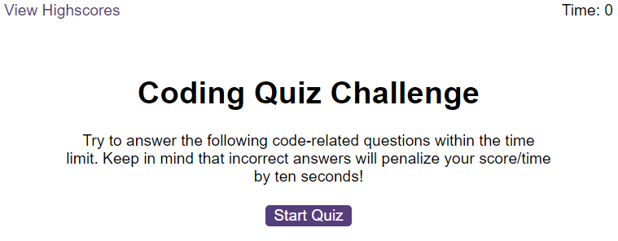

# JavaScript Coding Quiz

## Overview

This web application is a coding quiz designed for coding boot camp students to test their knowledge of JavaScript fundamentals. The quiz runs in the browser and features dynamically updated HTML and CSS, all powered by JavaScript code. The user interface is clean, polished, and responsive, ensuring adaptability to various screen sizes.

## Preview



## Link to the Deployed Application

[JavaScript Coding Quiz](https://volodymyr-shtyka.github.io/quiz-genius/)

## Instructions

1. **Clone the Repository:**
    - Clone the repository to your local machine using the following command:
      ```
      git clone git@github.com:Volodymyr-Shtyka/quiz-genius.git
      ```

2. **Navigate to the Project Directory:**
    - Change into the project directory:
      ```
      cd quiz-genius
      ```

3. **Open the Index.html File:**
    - Open the `index.html` file in a web browser to access and take the coding quiz.

4. **Start the Quiz:**
    - Click the "Start Quiz" button to initiate the quiz.
    - Answer each question by clicking on the provided choices.

5. **Quiz Timer:**
    - The quiz has a timer that starts counting down when the quiz begins.
    - Incorrect answers will deduct time from the clock.

6. **Quiz End:**
    - The quiz ends when all questions are answered or the timer reaches 0.

7. **Save High Score:**
    - After completing the quiz, enter your initials and click "Submit" to save your high score.
    - High scores can be viewed on the "View Highscores" page.

## Code Structure

- **index.html:** Main HTML file providing the structure of the coding quiz.
- **styles.css:** CSS file styling the appearance of the coding quiz.
- **questions.js:** JavaScript file containing an array of quiz questions.
- **logic.js:** JavaScript file containing the logic for the quiz functionality.
- **scores.js:** JavaScript file handling high scores and rendering.

## Notes

- The code ensures a responsive design, adapting to various screen sizes.
- User progress, including scores and initials, is stored in local storage.
- Explore, modify, and enhance the code to meet your preferences while ensuring the core functionality remains intact. Refer to code comments or documentation for assistance.
